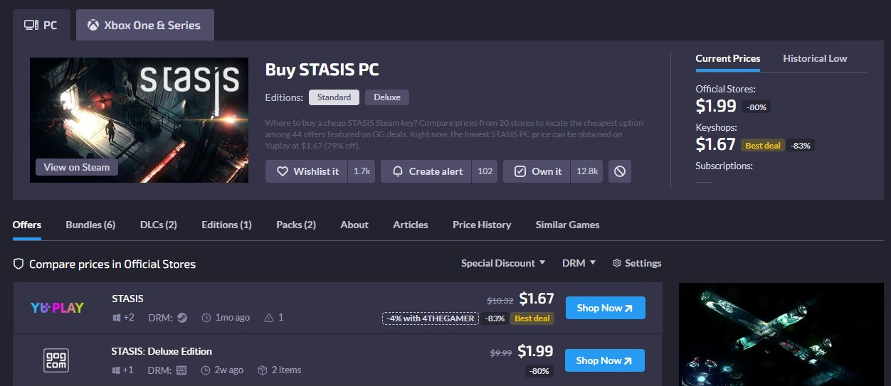

# Steam Deals

Allows users with a Steam account to view deals for games on their wishlist or library.<br>
https://store.steampowered.com/account/

## Table of Contents
- [Installation](#installation)
- [Usage](#usage)
- [Features](#features)
- [Displaying Images](#displaying-images)
- [Contributing](#contributing)
- [License](#license)
- [Contact](#contact)

## Installation

Clone repo. <br>
Open a terminal to the file location you want to install the project.
```bash
git clone https://github.com/jcmalott/steam_wishlist_deals.git
cd steam_wishlist_deals
npm install
```

## Usage

To run the application in default mode, displaying user wishlist deals, in the terminal within the project location.

```python
py main.py
```

This will open a Gradio web application.


For testing purposes, my default Steam ID will be displayed; alternatively, you can also enter your ID. <br>
To start the search for deals, click within the ID box and hit Enter. <br>
The application will need to retrieve your wishlist from Steam and search each game individually. Steam only allows
looking up a single game at a time.

Once ready, all deals will be displayed.


A drop-down search bar is displayed at the top for displaying a single game. <br>
From top to bottom.
- Current Best Deal
- The cheapest price it sold for
- Steam's current price
- Cheapest price sold on Steam

Click the GG Deams button to take you to that deal. <br>

Click the Steam button to go to that game's Steam page.


## Features

List the key features of the project.

- Feature 1
- Feature 2
- Feature 3

## Displaying Images

To include images in your project documentation, use the following Markdown syntax. Store images in a dedicated folder (e.g., `images/`) in your repository.

### Example
```markdown

```

### Steps
1. Create an `images` folder in your repository.
2. Add your image files (e.g., `screenshot.png`) to the `images` folder.
3. Use the Markdown syntax above, replacing `Alt text for accessibility` with a descriptive text for screen readers and `images/screenshot.png` with the correct path to your image.

### Sample Image


*Note: Ensure the image file exists in the specified path before adding the Markdown.*

## Contributing

Explain how others can contribute to the project.

1. Fork the repository
2. Create a new branch (`git checkout -b feature-branch`)
3. Commit your changes (`git commit -m 'Add some feature'`)
4. Push to the branch (`git push origin feature-branch`)
5. Open a Pull Request

## License

This project is licensed under the MIT License - see the [LICENSE](LICENSE) file for details.

## Contact

- Project Maintainer: [Your Name](mailto:your.email@example.com)
- Project Link: [https://github.com/username/repository](https://github.com/username/repository)
